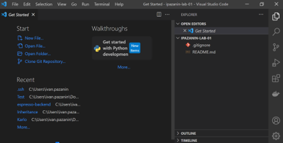
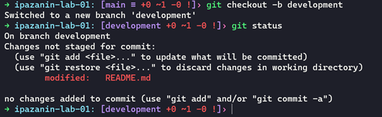
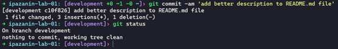
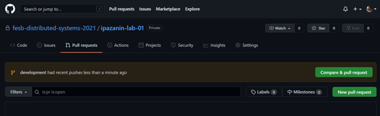
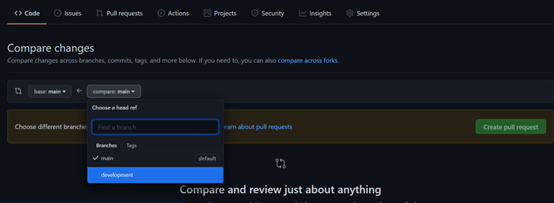
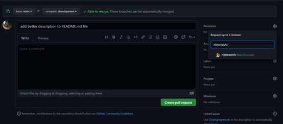
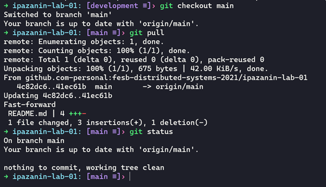

# Lab 0: Git

## Table Of Contents

- [Lab 0: Git](#lab-0-git)
  - [Table Of Contents](#table-of-contents)
  - [**Exercise 3: Creating GitHub Repository**](#exercise-3-creating-github-repository)
    - [**Create remote repository**](#create-remote-repository)
  - [**Exercise 4: Cloning remote git repository and creating pull request**](#exercise-4-cloning-remote-git-repository-and-creating-pull-request)
    - [**Cloning repository**](#cloning-repository)
    - [**Adding and committing code to repository**](#adding-and-committing-code-to-repository)
    - [**Creating Pull Request**](#creating-pull-request)


## **Exercise 3: Creating GitHub Repository**

### **Create remote repository**

To create remote repository on github first go to your account or organization (ex: <https://github.com/fesb-distributed-systems-2022> )
and press Create a new repository button (<https://github.com/organizations/fesb-distributed-systems-2022/repositories/new> )


Repository name should follow pattern: `{your-username}-lab-{lab-number}` (ex: `ipazanin-lab-01`)

Or if repository is not part of lab practice: `{your-username}-{project-name}` (ex: `nknezovic-mothers-project`)

Description is optional, repository must be private, and finally initialize repository by adding README file, adding .gitignore (VisualStudio).


## **Exercise 4: Cloning remote git repository and creating pull request**

### **Cloning repository**

To clone remote repository go to created repository on github and press Code > SSH and copy contents.


Open terminal on desired file system location and use command:

`git-clone {your-repository}` (ex: `git-clone git@github.com:fesb-distributed-systems-2021/ipazanin-lab-01.git`)

and now you can open cloned repository with Visual Studio Code using:
`code {your-repository-name}` (ex: `code ipazanin-lab-01`)



You can learn more about .gitignore file on link <https://git-scm.com/docs/gitignore>

### **Adding and committing code to repository**

If you have previously created a project, you can copy and paste it to the repository folder or you can start creating a new project in the git folder.

Once you are satisfied with your code changes, you must commit them.
But first checkout to the new branch, code development is never done on the main branch (you can checkout to the new branch while having changes).

Open terminal in repository folder and use commands:

To check status of your project:

```shell
git status
```


Tells me I have one un-staged file changed (README.md)

To create new branch and change git to that branch use:

`git checkout -b {your-branch-name}`
(ex: `git checkout -b development`)

Until you know what you are doing, I recommend doing development on branch development.

```shell
git status
```



To stage all files use:

```shell
git add .
git status
```


Now status tells me I have one file staged.

To commit all staged files use:

`git commit -m '{your-commit-message}'`

(ex: `git commit -m 'add better description to README.md file'`)
Commit messages MUST be meaningful short and descriptive, and without tenses (added > add)

`git status`



To push branch changes to remote repository use:

`git push`


Message notifies we don’t have branch named development on remote repository (GitHub) so we must use to create it:

```shell
git push --set-upstream origin development
```

### **Creating Pull Request**

Once you are satisfied with code on your development branch, you can create pull request on the main branch.

Pull requests will merge changes to the main branch to sync their code.

On GitHub navigate to page Pull request in your repository.



And create new pull request by pressing new pull request.




Before you finish creating pull requests, add **ipazanin** as reviewer. (**NOT nknezovic** as in picture below)



**AFTER ipazanin** has approved your pull request, you can merge it using button.


Merge pull request.

To fetch changes on main branch locally, checkout to main branch in your terminal and:

```shell
git checkout main
git pull
git status
```



And you will see changes done on development branch now on main branch.

**Notes***

When you get a comment on your pull request, you should correct your code accordingly and push a new commit to the remote branch using the same commands as described before.
