# Lab 0: Environment Setup

## Table Of Contents

## Requirements

To successfully work and complete the lab assignments for the *Distributed Systems* and *Software Engineering* courses, a student **MUST** have following installed on his/her personal computer:

- Visual Studio Code ([Link](https://code.visualstudio.com))
- Git ([Link](https://git-scm.com/downloads))
- Personal GitHub account ([Link](https://github.com/))
- .NET 6 SDK ([Link](https://dotnet.microsoft.com/en-us/download/dotnet/6.0) - SDK 6.0.415 version)

## **Step 1: Installing VS Code**

Download and install VS Code from the link in `Requirements` section.

## **Step 2: Installing and Configuring Git**

Git is the most used distributed version control system.
  
### **Download and setup git**

Download and install git from the link in `Requirements`.

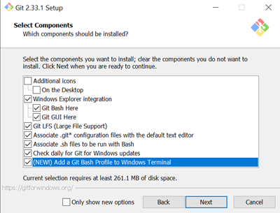

If you know what you are doing, you can choose Vim as git’s default text editor, otherwise, I recommend using Visual Studio Code.

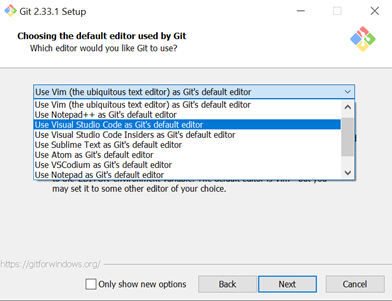

Default branch name doesn’t matter much but it is still best to follow common practices which means naming it `main` branch.

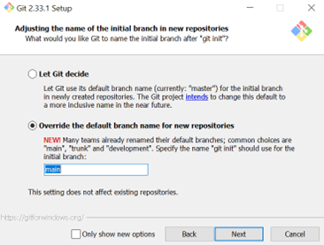

This step enables us to use git from other tools, for example powershell.

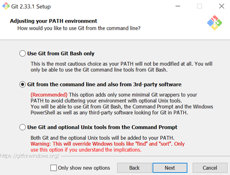

Configure SSH for git as follows:

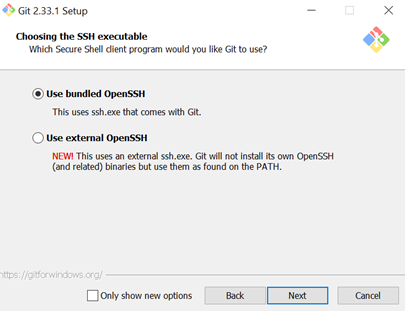
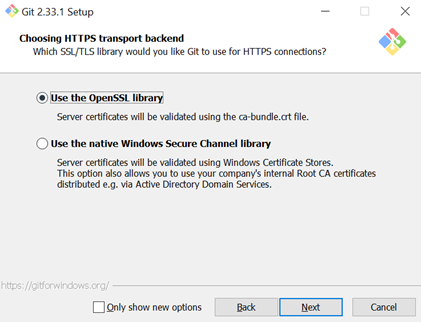

Follow the rest of installation steps and choose default options until git is installed.

### **Generate SSH keys**

> NOTE: For detailed information on GitHub and SSH keys please refer to the [Official GitHub Guide to SSH keys - Part 1](https://docs.github.com/en/authentication/connecting-to-github-with-ssh/generating-a-new-ssh-key-and-adding-it-to-the-ssh-agent) and [Part 2](https://docs.github.com/en/authentication/connecting-to-github-with-ssh/adding-a-new-ssh-key-to-your-github-account)

Git communicates with remote repositories using **SSH** protocol which is secured by private and public keys encryption.

In order for repositories to have access to remote repositories, private SSH keys which are generated locally must be added on remote repository vendors, for example GitHub, bitbucket…

To generate ssh keys, use command in your terminal:

```shell
ssh-keygen -t ed25519 -C "your_email@example.com"
```

and press enter for all options (leave the passwords blank)


SSH keypair is generated default location as stated
`C:\Users\vboxuser\.ssh\id_ed25519` or more generally `C:\Users\{your-username}\.ssh\id_ed25519`.

## **Step 3: Configuring GitHub**

GitHub is a provider of internet hosting for software development and version control using git. **If you do not have a GitHub account, create one before proceeding. Please use your real name and surname.**

### **Adding public SSH key to GitHub**

Open generated public ssh key (id_ed25519.pub file) in text editor and copy all contents (CTRL+a, CTRL+c). The contents should look something like this:

```
ssh-ed25519 AAAAC3NzaC1lZDI1NTE5AAAAILkPEqsQLyPVHJJLLtiK2f25hNc/tbTAOmp04+JPiiBa vboxuser@mail.com
```

> Note: You can open the folder from `cmd` and/or `powershell` by typing: `explorer.exe C:\Users\<user>\.ssh` (i.e. `explorer.exe C:\Users\vboxuser\.ssh`)

In github go to: profile icon > Settings > SSH and GPG keys > New SSH key
Or <https://github.com/settings/keys>
In Title input give name for your SSH key (ex: my-personal-laptop)
In Key input paste copied public SSH key


After clicking on the `New SSH Key` button in the upper right corner:

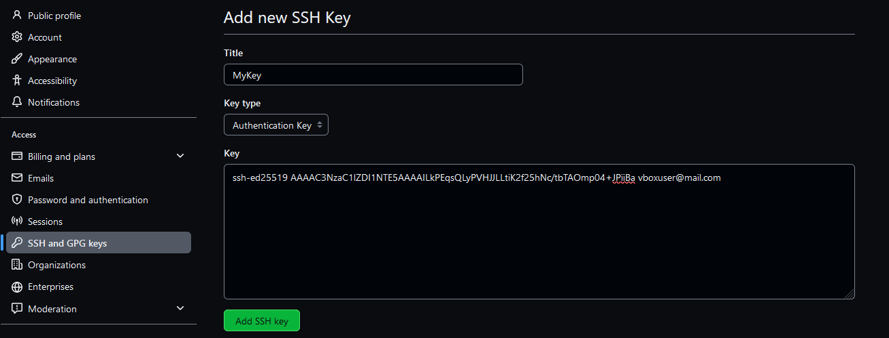

To add keypress, Add SSH key, no error message should be present if everything is done correctly.


### **Testing the GitHub SSH key**

To test if the SSH keys are working successfully, in `cmd` or `powershell` run the following command:
```shell
ssh -T git@github.com
```

(If you are prompted with a message `The authenticity of host 'github.com (X.X.X.X)' can't be established. [...]`, type `yes` and press `Enter` to verify that you trust the GitHub server.)

If the output similar to this:

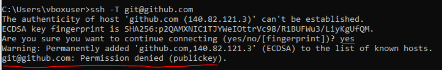

**Then the SSH keys do not work.** Delete the added keys on the GitHub and repeat previous steps, or ask the assistant for help.

But, if the output is similar to this:

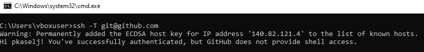

**Congratulations, you have successfully configured Git(Hub) SSH keys.**

## **Step 4: Installing .NET 6 SDK**

To build and run C# applications, we need a *.NET SDK - Software Development Kit*. Download and run the SDK installer from the link in the *Requirements* section (most commonly x64 version - for 64-bit *Windows* OS).

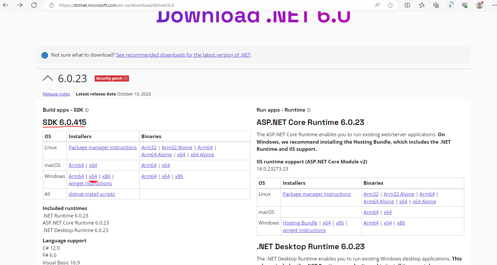

After a short installation, verify the .NET SDK is installed by entering the following command in the `cmd` or `powershell`:

```shell
dotnet --version
```

If the output is similar to the one below:

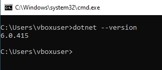

**Congratulations, you have successfully installed .NET SDK on your PC.** But if the commands throws an error or **shows a different** version, please delete the SDK and install it again following the steps in this document, or ask the assistant for help.

# Conclusion

If you have successfully finished all installations, you can proceed with the lab exercises, but if you encounter any errors, please refer to the assistant for help at `petar.kaselj.00@fesb.hr`.