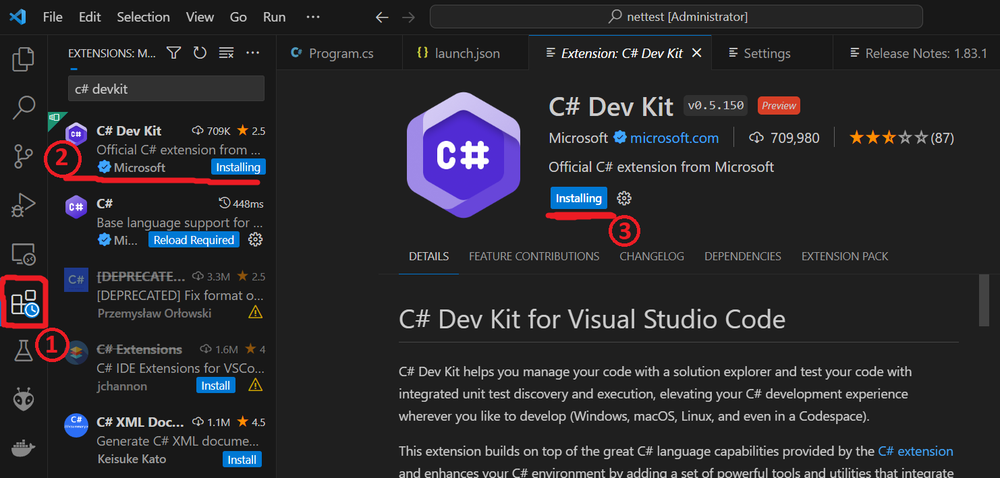
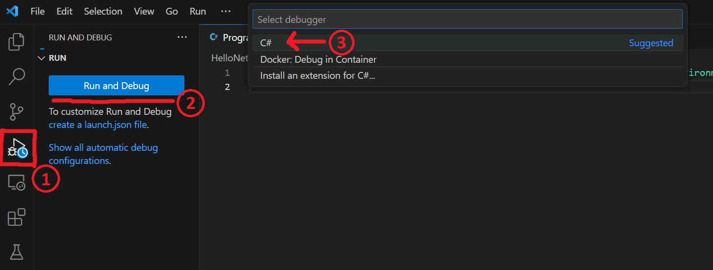
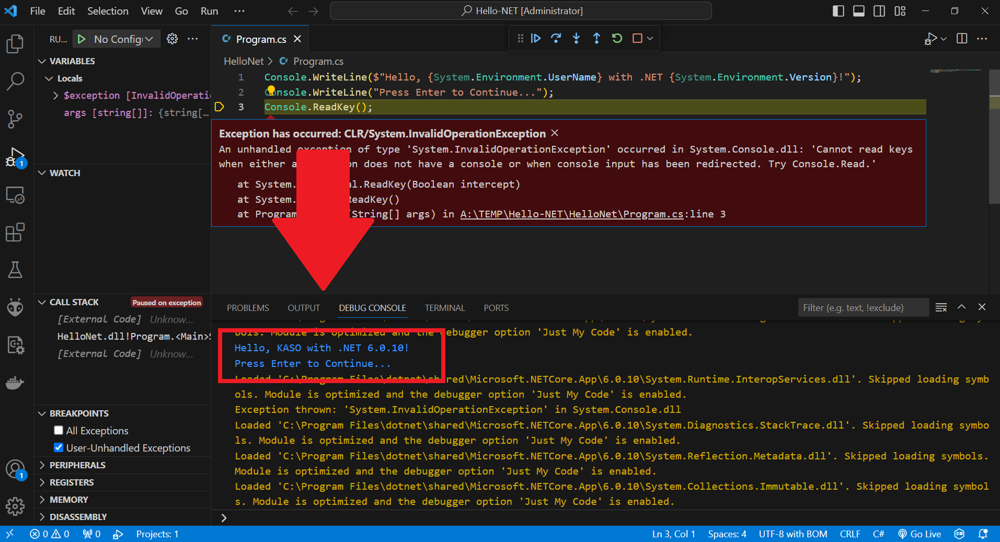

# Preparation

# Lab 2: Threads

## Table of Contents

- [Preparation](#preparation)
- [Lab 2: Threads](#lab-2-threads)
  - [Table of Contents](#table-of-contents)
  - [**Step 1: Prepare VS Code for C# Development**](#step-1-prepare-vs-code-for-c-development)

## **Step 1: Prepare VS Code for C# Development**

1. Open *Visual Studio Code*
2. Go to *Extensions* tab
3. Search and install *C# Dev Kit*
> **NOTE:** If you get a version error, please install the newer version of *Visual Studio Code* from the official page at [LINK](https://code.visualstudio.com/)

4. Clone [`Hello-NET`](https://github.com/fesb-distributed-systems-2023/hello-net/tree/master) repository from the organization
5. Go to *Run and Debug* tab and press on *Run and Debug* button and then choose *C#* option

6. After this, you should be able to run the C# application and see the output in the console, as shown in figure below (*ignore the big red exception*):

> **!!!!!!!! In case of an error, please refer to the assistant for help !!!!!!!!**
