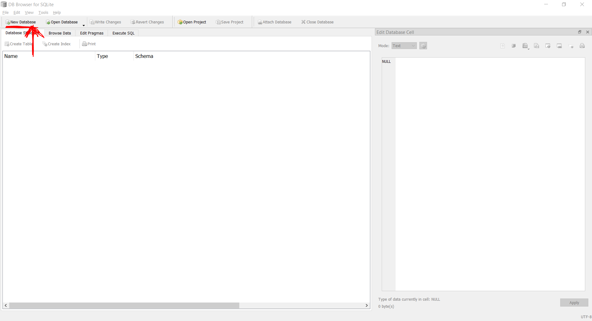
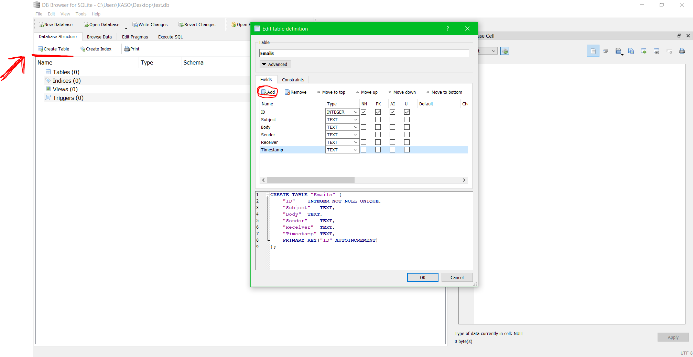
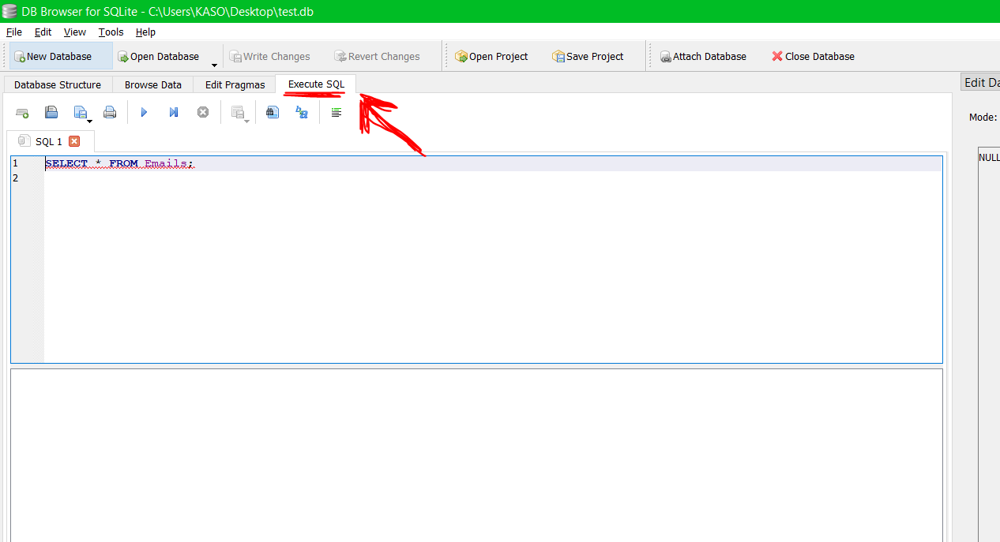
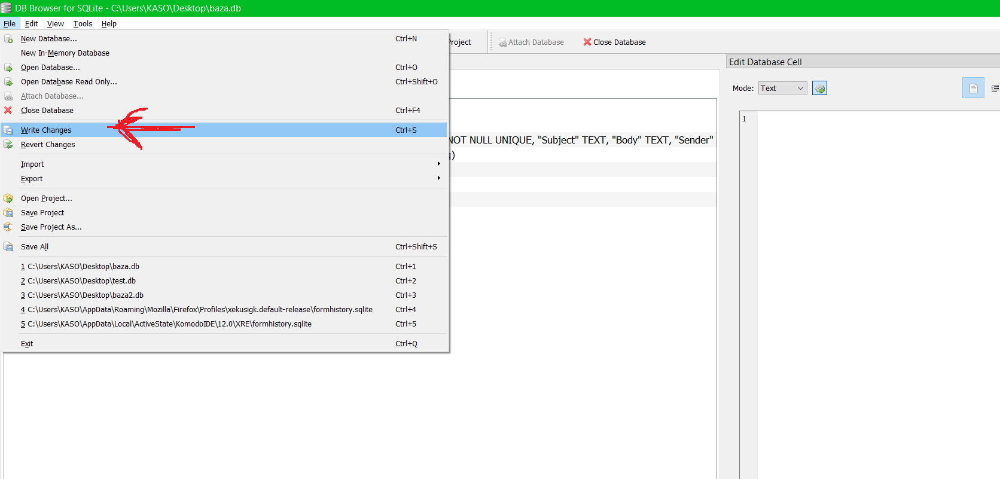

# Homework Assignments

## Table of Contents

- [Homework Assignments](#homework-assignments)
  - [Table of Contents](#table-of-contents)
- [Homeworks](#homeworks)
  - [Homework 2 - Web API Basics](#homework-2---web-api-basics)
    - [General (Important)](#general-important)
    - [\[HW2\] Matej Baljak\*](#hw2-matej-baljak)
    - [\[HW2\] Ante Bilić](#hw2-ante-bilić)
    - [\[HW2\] Karlo Čarija](#hw2-karlo-čarija)
    - [\[HW2\] Martin Čelar](#hw2-martin-čelar)
    - [\[HW2\] Bruno Grbavac](#hw2-bruno-grbavac)
    - [\[HW2\] Robert Jukić-Bračulj\*](#hw2-robert-jukić-bračulj)
    - [\[HW2\] Željko Kalajžić](#hw2-željko-kalajžić)
    - [\[HW2\] Damira Mamuzić](#hw2-damira-mamuzić)
    - [\[HW2\] Kruno Manenica](#hw2-kruno-manenica)
    - [\[HW2\] Ante Marušić](#hw2-ante-marušić)
    - [\[HW2\] Luka Nikolac](#hw2-luka-nikolac)
    - [\[HW2\] Sara Pavlović](#hw2-sara-pavlović)
    - [\[HW2\] Roko Ražov](#hw2-roko-ražov)
    - [\[HW2\] Josip Sanader](#hw2-josip-sanader)
    - [\[HW2\] Emilija Sarić](#hw2-emilija-sarić)
    - [\[HW2\] Tihana Slavić](#hw2-tihana-slavić)
    - [\[HW2\] Ivan Stojković](#hw2-ivan-stojković)
    - [\[HW2\] Luka Svaguša](#hw2-luka-svaguša)
    - [\[HW2\] Edita Škec](#hw2-edita-škec)
    - [\[HW2\] Marin Uzinić](#hw2-marin-uzinić)
    - [\[HW2\] Marija Vladimir](#hw2-marija-vladimir)
    - [\[HW2\] Filip Volarević](#hw2-filip-volarević)
    - [\[HW2\] Jere Zambarlin\*](#hw2-jere-zambarlin)
  - [Homework 3 - Domain-specific Web API with CRUD interface](#homework-3---domain-specific-web-api-with-crud-interface)
    - [General](#general)
    - [\[HW3\] Phase 1](#hw3-phase-1)
    - [\[HW3\] Phase 2](#hw3-phase-2)
  - [Homework 4 - SQL](#homework-4---sql)
    - [General](#general-1)
    - [Task](#task)
    - [Hints](#hints)
  - [Homework 4 - SQL Repository](#homework-4---sql-repository)
    - [General](#general-2)
    - [Task](#task-1)
  - [Homework 6 - Business Logic](#homework-6---business-logic)
    - [General](#general-3)
    - [Task](#task-2)

# Homeworks

## Homework 2 - Web API Basics

### General (Important)

> **IMPORTANT:** This paragraph applies to all students and homeworks

- Write a comment at the top of your controller file where you state:
  - Your name
  - Your task
  - A few senteces explaining what does your program do

Use the following template:

```csharp
/*
 **********************************
 * Author: <Your Name>
 * Project Task: <Your Task (See the list below)>
 **********************************
 * Description:
 *  
 *  <Write a few senteces explaining what does your program do>
 *
 **********************************
 */
```


> **IMPORTANT:** For an example see [Lab 5 - Controller Example](../labs/05.Lab%205%20-%20HTTP%20Programming/Controller%20Example.md) and for help with creating a project and/or a controller see [Lab 5 - Creating a Web API](../labs/05.Lab%205%20-%20HTTP%20Programming/Creating%20a%20Web%20API.md).

> **NOTE:** *Endpoints* are "functions" that are called when a request with specific route is received. In the example above ([Lab 5 - Controller Example](../labs/05.Lab%205%20-%20HTTP%20Programming/Controller%20Example.md)), the *endpoints* are functions `GetStudents()`, `GetStudentByIndexFromRoute()`, `GetStudentByIndexFromQuery`, `GetStudentByIndexFromBody`. Each *endpoint* has its own unique route e.g. `/students`, `/student/{id}`, ...


### [HW2] Matej Baljak\*
- **Project Task:** University
- **Requirements:**
  - Create a controller (`UniversityController.cs`) with 3 endpoints (functions)
    - Endpoint 1:
      - Takes *two* parameters (Student name, University name) from *Route*
      - Returns a response with status 200 OK and a text `"Student {Student name} enrolled at {University name} University :: from route"`
    - Endpoint 2:
      - Takes *two* parameters (Student name, University name) from *Query*
      - Returns a response with status 200 OK and a text `"Student {Student name} enrolled at {University name} University :: from query"`
    - Endpoint 3:
      - Takes *one* parameter (University name) from *Body*
      - Returns a response with status 200 OK and a text `"Hello from {University name} University!"`


### [HW2] Ante Bilić
- **Project Task:** Hospital
- **Requirements:**
  - Create a controller (`HospitalController.cs`) with 3 endpoints (functions)
    - Endpoint 1:
      - Takes *two* parameters (Patient name, Hospital name) from *Route*
      - Returns a response with status 200 OK and a text `"Patient {Patient name} admitted to {Hospital name} Hospital :: from route"`
    - Endpoint 2:
      - Takes *two* parameters (Patient name, Hospital name) from *Query*
      - Returns a response with status 200 OK and a text `"Patient {Patient name} admitted to {Hospital name} Hospital :: from query"`
    - Endpoint 3:
      - Takes *one* parameter (Hospital name) from *Body*
      - Returns a response with status 200 OK and a text `"Hello from {Hospital name} Hospital!"`


### [HW2] Karlo Čarija
- **Project Task:** Grocery Shop
- **Requirements:**
  - Create a controller (`GroceryShopController.cs`) with 3 endpoints (functions)
    - Endpoint 1:
      - Takes *two* parameters (Grocery name, Grocery Shop name) from *Route*
      - Returns a response with status 200 OK and a text `"Grocery {Grocery name} bought at {Grocery Shop name} Grocery Shop :: from route"`
    - Endpoint 2:
      - Takes *two* parameters (Grocery name, Grocery Shop name) from *Query*
      - Returns a response with status 200 OK and a text `"Grocery {Grocery name} bought at {Grocery Shop name} Grocery Shop :: from query"`
    - Endpoint 3:
      - Takes *one* parameter (Grocery Shop name) from *Body*
      - Returns a response with status 200 OK and a text `"Hello from {Grocery Shop name} Grocery Shop!"`


### [HW2] Martin Čelar
- **Project Task:** Shoe Shop
- **Requirements:**
  - Create a controller (`ShoeShopController.cs`) with 3 endpoints (functions)
    - Endpoint 1:
      - Takes *two* parameters (Shoe Model name, Shoe Shop name) from *Route*
      - Returns a response with status 200 OK and a text `"Shoe Model {Shoe Model name} bought at {Shoe Shop name} Shoe Shop :: from route"`
    - Endpoint 2:
      - Takes *two* parameters (Shoe Model name, Shoe Shop name) from *Query*
      - Returns a response with status 200 OK and a text `"Shoe Model {Shoe Model name} bought at {Shoe Shop name} Shoe Shop :: from query"`
    - Endpoint 3:
      - Takes *one* parameter (Shoe Shop name) from *Body*
      - Returns a response with status 200 OK and a text `"Hello from {Shoe Shop name} Shoe Shop!"`


### [HW2] Bruno Grbavac
- **Project Task:** Library
- **Requirements:**
  - Create a controller (`LibraryController.cs`) with 3 endpoints (functions)
    - Endpoint 1:
      - Takes *two* parameters (Book name, Library name) from *Route*
      - Returns a response with status 200 OK and a text `"Book {Book name} borrowed from {Library name} Library :: from route"`
    - Endpoint 2:
      - Takes *two* parameters (Book name, Library name) from *Query*
      - Returns a response with status 200 OK and a text `"Book {Book name} borrowed from {Library name} Library :: from query"`
    - Endpoint 3:
      - Takes *one* parameter (Library name) from *Body*
      - Returns a response with status 200 OK and a text `"Hello from {Library name} Library!"`


### [HW2] Robert Jukić-Bračulj\*
- **Project Task:** Pet Shop
- **Requirements:**
  - Create a controller (`PetShopController.cs`) with 3 endpoints (functions)
    - Endpoint 1:
      - Takes *two* parameters (Pet name, Pet Shop name) from *Route*
      - Returns a response with status 200 OK and a text `"Pet {Pet name} bought from {Pet Shop name} Pet Shop :: from route"`
    - Endpoint 2:
      - Takes *two* parameters (Pet name, Pet Shop name) from *Query*
      - Returns a response with status 200 OK and a text `"Pet {Pet name} bought from {Pet Shop name} Pet Shop :: from query"`
    - Endpoint 3:
      - Takes *one* parameter (Pet Shop name) from *Body*
      - Returns a response with status 200 OK and a text `"Hello from {Pet Shop name} Pet Shop!"`


### [HW2] Željko Kalajžić
- **Project Task:** Factory
- **Requirements:**
  - Create a controller (`FactoryController.cs`) with 3 endpoints (functions)
    - Endpoint 1:
      - Takes *two* parameters (Car Model name, Factory name) from *Route*
      - Returns a response with status 200 OK and a text `"Car Model {Car Model name} manufactured at {Factory name} Factory :: from route"`
    - Endpoint 2:
      - Takes *two* parameters (Car Model name, Factory name) from *Query*
      - Returns a response with status 200 OK and a text `"Car Model {Car Model name} manufactured at {Factory name} Factory :: from query"`
    - Endpoint 3:
      - Takes *one* parameter (Factory name) from *Body*
      - Returns a response with status 200 OK and a text `"Hello from {Factory name} Factory!"`


### [HW2] Damira Mamuzić
- **Project Task:** City
- **Requirements:**
  - Create a controller (`CityController.cs`) with 3 endpoints (functions)
    - Endpoint 1:
      - Takes *two* parameters (Resident name, City name) from *Route*
      - Returns a response with status 200 OK and a text `"Resident {Resident name} lives in {City name} City :: from route"`
    - Endpoint 2:
      - Takes *two* parameters (Resident name, City name) from *Query*
      - Returns a response with status 200 OK and a text `"Resident {Resident name} lives in {City name} City :: from query"`
    - Endpoint 3:
      - Takes *one* parameter (City name) from *Body*
      - Returns a response with status 200 OK and a text `"Hello from {City name} City!"`


### [HW2] Kruno Manenica
- **Project Task:** Store
- **Requirements:**
  - Create a controller (`StoreController.cs`) with 3 endpoints (functions)
    - Endpoint 1:
      - Takes *two* parameters (Laptop Model name, Store name) from *Route*
      - Returns a response with status 200 OK and a text `"Laptop Model {Laptop Model name} serviced at {Store name} Store :: from route"`
    - Endpoint 2:
      - Takes *two* parameters (Laptop Model name, Store name) from *Query*
      - Returns a response with status 200 OK and a text `"Laptop Model {Laptop Model name} serviced at {Store name} Store :: from query"`
    - Endpoint 3:
      - Takes *one* parameter (Store name) from *Body*
      - Returns a response with status 200 OK and a text `"Hello from {Store name} Store!"`


### [HW2] Ante Marušić
- **Project Task:** Weather Station
- **Requirements:**
  - Create a controller (`WeatherStationController.cs`) with 3 endpoints (functions)
    - Endpoint 1:
      - Takes *two* parameters (Temperature name, Weather Station name) from *Route*
      - Returns a response with status 200 OK and a text `"Temperature {Temperature value} reading at {Weather Station name} Weather Station :: from route"`
    - Endpoint 2:
      - Takes *two* parameters (Temperature name, Weather Station name) from *Query*
      - Returns a response with status 200 OK and a text `"Temperature {Temperature value} reading at {Weather Station name} Weather Station :: from query"`
    - Endpoint 3:
      - Takes *one* parameter (Weather Station name) from *Body*
      - Returns a response with status 200 OK and a text `"Hello from {Weather Station name} Weather Station!"`


### [HW2] Luka Nikolac
- **Project Task:** Airport
- **Requirements:**
  - Create a controller (`AirportController.cs`) with 3 endpoints (functions)
    - Endpoint 1:
      - Takes *two* parameters (Plane name, Airport name) from *Route*
      - Returns a response with status 200 OK and a text `"Plane {Plane name} lands at {Airport name} Airport :: from route"`
    - Endpoint 2:
      - Takes *two* parameters (Plane name, Airport name) from *Query*
      - Returns a response with status 200 OK and a text `"Plane {Plane name} lands at {Airport name} Airport :: from query"`
    - Endpoint 3:
      - Takes *one* parameter (Airport name) from *Body*
      - Returns a response with status 200 OK and a text `"Hello from {Airport name} Airport!"`


### [HW2] Sara Pavlović
- **Project Task:** Shelter
- **Requirements:**
  - Create a controller (`ShelterController.cs`) with 3 endpoints (functions)
    - Endpoint 1:
      - Takes *two* parameters (Animal name, Shelter name) from *Route*
      - Returns a response with status 200 OK and a text `"Animal {Animal name} admitted to {Shelter name} Shelter :: from route"`
    - Endpoint 2:
      - Takes *two* parameters (Animal name, Shelter name) from *Query*
      - Returns a response with status 200 OK and a text `"Animal {Animal name} admitted to {Shelter name} Shelter :: from query"`
    - Endpoint 3:
      - Takes *one* parameter (Shelter name) from *Body*
      - Returns a response with status 200 OK and a text `"Hello from {Shelter name} Shelter!"`


### [HW2] Roko Ražov
- **Project Task:** Port
- **Requirements:**
  - Create a controller (`PortController.cs`) with 3 endpoints (functions)
    - Endpoint 1:
      - Takes *two* parameters (Ship name, Port name) from *Route*
      - Returns a response with status 200 OK and a text `"Ship {Ship name} docked at {Port name} Port :: from route"`
    - Endpoint 2:
      - Takes *two* parameters (Ship name, Port name) from *Query*
      - Returns a response with status 200 OK and a text `"Ship {Ship name} docked at {Port name} Port :: from query"`
    - Endpoint 3:
      - Takes *one* parameter (Port name) from *Body*
      - Returns a response with status 200 OK and a text `"Hello from {Port name} Port!"`


### [HW2] Josip Sanader
- **Project Task:** Company
- **Requirements:**
  - Create a controller (`CompanyController.cs`) with 3 endpoints (functions)
    - Endpoint 1:
      - Takes *two* parameters (Employee name, Company name) from *Route*
      - Returns a response with status 200 OK and a text `"Employee {Employee name} employed at {Company name} Company :: from route"`
    - Endpoint 2:
      - Takes *two* parameters (Employee name, Company name) from *Query*
      - Returns a response with status 200 OK and a text `"Employee {Employee name} employed at {Company name} Company :: from query"`
    - Endpoint 3:
      - Takes *one* parameter (Company name) from *Body*
      - Returns a response with status 200 OK and a text `"Hello from {Company name} Company!"`


### [HW2] Emilija Sarić
- **Project Task:** Bus Destinaton
- **Requirements:**
  - Create a controller (`BusDestinatonController.cs`) with 3 endpoints (functions)
    - Endpoint 1:
      - Takes *two* parameters (Driver name, Bus Destinaton name) from *Route*
      - Returns a response with status 200 OK and a text `"Driver {Driver name} drives to {Bus Destinaton name} Bus Destinaton :: from route"`
    - Endpoint 2:
      - Takes *two* parameters (Driver name, Bus Destinaton name) from *Query*
      - Returns a response with status 200 OK and a text `"Driver {Driver name} drives to {Bus Destinaton name} Bus Destinaton :: from query"`
    - Endpoint 3:
      - Takes *one* parameter (Bus Destinaton name) from *Body*
      - Returns a response with status 200 OK and a text `"Hello from {Bus Destinaton name} Bus Destinaton!"`


### [HW2] Tihana Slavić
- **Project Task:** Taxi Company
- **Requirements:**
  - Create a controller (`TaxiCompanyController.cs`) with 3 endpoints (functions)
    - Endpoint 1:
      - Takes *two* parameters (Client name, Taxi Company name) from *Route*
      - Returns a response with status 200 OK and a text `"Client {Client name} booked a ride from {Taxi Company name} Taxi Company :: from route"`
    - Endpoint 2:
      - Takes *two* parameters (Client name, Taxi Company name) from *Query*
      - Returns a response with status 200 OK and a text `"Client {Client name} booked a ride from {Taxi Company name} Taxi Company :: from query"`
    - Endpoint 3:
      - Takes *one* parameter (Taxi Company name) from *Body*
      - Returns a response with status 200 OK and a text `"Hello from {Taxi Company name} Taxi Company!"`


### [HW2] Ivan Stojković
- **Project Task:** Hotel
- **Requirements:**
  - Create a controller (`HotelController.cs`) with 3 endpoints (functions)
    - Endpoint 1:
      - Takes *two* parameters (Person name, Hotel name) from *Route*
      - Returns a response with status 200 OK and a text `"Person {Person name} booked stay at {Hotel name} Hotel :: from route"`
    - Endpoint 2:
      - Takes *two* parameters (Person name, Hotel name) from *Query*
      - Returns a response with status 200 OK and a text `"Person {Person name} booked stay at {Hotel name} Hotel :: from query"`
    - Endpoint 3:
      - Takes *one* parameter (Hotel name) from *Body*
      - Returns a response with status 200 OK and a text `"Hello from {Hotel name} Hotel!"`


### [HW2] Luka Svaguša
- **Project Task:** Trophy
- **Requirements:**
  - Create a controller (`TrophyController.cs`) with 3 endpoints (functions)
    - Endpoint 1:
      - Takes *two* parameters (Sport Club name, Trophy name) from *Route*
      - Returns a response with status 200 OK and a text `"Sport Club {Sport Club name} won this year's {Trophy name} Trophy :: from route"`
    - Endpoint 2:
      - Takes *two* parameters (Sport Club name, Trophy name) from *Query*
      - Returns a response with status 200 OK and a text `"Sport Club {Sport Club name} won this year's {Trophy name} Trophy :: from query"`
    - Endpoint 3:
      - Takes *one* parameter (Trophy name) from *Body*
      - Returns a response with status 200 OK and a text `"Hello from {Trophy name} Trophy!"`


### [HW2] Edita Škec
- **Project Task:** Sport Club
- **Requirements:**
  - Create a controller (`SportClubController.cs`) with 3 endpoints (functions)
    - Endpoint 1:
      - Takes *two* parameters (Player name, Sport Club name) from *Route*
      - Returns a response with status 200 OK and a text `"Player {Player name} transferred to {Sport Club name} Sport Club :: from route"`
    - Endpoint 2:
      - Takes *two* parameters (Player name, Sport Club name) from *Query*
      - Returns a response with status 200 OK and a text `"Player {Player name} transferred to {Sport Club name} Sport Club :: from query"`
    - Endpoint 3:
      - Takes *one* parameter (Sport Club name) from *Body*
      - Returns a response with status 200 OK and a text `"Hello from {Sport Club name} Sport Club!"`


### [HW2] Marin Uzinić
- **Project Task:** Cinema
- **Requirements:**
  - Create a controller (`CinemaController.cs`) with 3 endpoints (functions)
    - Endpoint 1:
      - Takes *two* parameters (Movie name, Cinema name) from *Route*
      - Returns a response with status 200 OK and a text `"Movie {Movie name} played in {Cinema name} Cinema :: from route"`
    - Endpoint 2:
      - Takes *two* parameters (Movie name, Cinema name) from *Query*
      - Returns a response with status 200 OK and a text `"Movie {Movie name} played in {Cinema name} Cinema :: from query"`
    - Endpoint 3:
      - Takes *one* parameter (Cinema name) from *Body*
      - Returns a response with status 200 OK and a text `"Hello from {Cinema name} Cinema!"`


### [HW2] Marija Vladimir
- **Project Task:** Country
- **Requirements:**
  - Create a controller (`CountryController.cs`) with 3 endpoints (functions)
    - Endpoint 1:
      - Takes *two* parameters (Animal name, Country name) from *Route*
      - Returns a response with status 200 OK and a text `"Animal {Animal name} lives in {Country name} Country :: from route"`
    - Endpoint 2:
      - Takes *two* parameters (Animal name, Country name) from *Query*
      - Returns a response with status 200 OK and a text `"Animal {Animal name} lives in {Country name} Country :: from query"`
    - Endpoint 3:
      - Takes *one* parameter (Country name) from *Body*
      - Returns a response with status 200 OK and a text `"Hello from {Country name} Country!"`


### [HW2] Filip Volarević
- **Project Task:** Newspaper
- **Requirements:**
  - Create a controller (`NewspaperController.cs`) with 3 endpoints (functions)
    - Endpoint 1:
      - Takes *two* parameters (Reporter name, Newspaper name) from *Route*
      - Returns a response with status 200 OK and a text `"Reporter {Reporter name} works at {Newspaper name} Newspaper :: from route"`
    - Endpoint 2:
      - Takes *two* parameters (Reporter name, Newspaper name) from *Query*
      - Returns a response with status 200 OK and a text `"Reporter {Reporter name} works at {Newspaper name} Newspaper :: from query"`
    - Endpoint 3:
      - Takes *one* parameter (Newspaper name) from *Body*
      - Returns a response with status 200 OK and a text `"Hello from {Newspaper name} Newspaper!"`


### [HW2] Jere Zambarlin\*
- **Project Task:** Country
- **Requirements:**
  - Create a controller (`CountryController.cs`) with 3 endpoints (functions)
    - Endpoint 1:
      - Takes *two* parameters (Currency name, Country name) from *Route*
      - Returns a response with status 200 OK and a text `"Currency {Currency name} is used in {Country name} Country :: from route"`
    - Endpoint 2:
      - Takes *two* parameters (Currency name, Country name) from *Query*
      - Returns a response with status 200 OK and a text `"Currency {Currency name} is used in {Country name} Country :: from query"`
    - Endpoint 3:
      - Takes *one* parameter (Country name) from *Body*
      - Returns a response with status 200 OK and a text `"Hello from {Country name} Country!"`

## Homework 3 - Domain-specific Web API with CRUD interface

### General

> **IMPORTANT:** This paragraph applies to all students and homeworks

- Write a comment at the top of **EACH FILE YOU CREATE** where you state:
  - Your name
  - Your task
  - A few senteces explaining what does your program do

Use the following template:

```csharp
/*
 **********************************
 * Author: <Your Name>
 * Project Task: Homework 3 - <Your Domain>
 **********************************
 * Description:
 *  
 *  <Write a few senteces explaining what does this class do>
 *
 **********************************
 */
```


> **IMPORTANT:** For an example see [Lab 5 - Controller Example](../labs/05.Lab%205%20-%20HTTP%20Programming/Controller%20Example.md) and for help with creating a project and/or a controller see [Lab 5 - Creating a Web API](../labs/05.Lab%205%20-%20HTTP%20Programming/Creating%20a%20Web%20API.md).

> **IMPORTANT:** All rules **MUST** be abided by, especially the [**Coding Convention**](../labs/Notes/Coding%20Convention.md)

> **NOTE:** *Endpoints* are "functions" that are called when a request with specific route is received. In the example above ([Lab 5 - Controller Example](../labs/05.Lab%205%20-%20HTTP%20Programming/Controller%20Example.md)), the *endpoints* are functions `GetStudents()`, `GetStudentByIndexFromRoute()`, `GetStudentByIndexFromQuery`, `GetStudentByIndexFromBody`. Each *endpoint* has its own unique route e.g. `/students`, `/student/{id}`, ...


### [HW3] Phase 1
- **Project Task:** Model Definition
- **Result:** A defined domain model
- **Requirements:**
	- Create a domain model for the application
	- Domain model **MUST** have *at least* 6 properties, of which *at least* 3 are domain properties.
	- Domain model **MUST** have at least one unique field e.g. ID.
	- Domain model must be a separate class inside a folder named *Domain*
	- Create a Pull Request to indicate completion
- **Deadline:** Friday, November 17th, 2023

### [HW3] Phase 2
- **Project Task:** Controller and Persistence Implementation
- **Result:** A working domain-specific Web API implementing CRUD interface
- **Requirements:**
	- Create a controller and place it in a folder named *Controllers*
	- Define 5 endpoints, one endpoint for each of the following CRUD operations
		- **Create** - Create a new model and insert it into storage
		- **Read All** - Get a collection of *all* models in storage
		- **Read Specific** - Get a model from storage by providing a unique identifier to the API
		- **Update** - Apply changes to a specific model in storage, identified by a unique value
		- **Delete** - Delete a specific model from storage, identified by a unique value
	- All routes, methods and classes **MUST** have meaningful names
	- Controller endpoints **MUST** be devoid of any logic, be thin and forward all calls to the *Persistence* layer
	- Create a model repository interface and a class that implements that interface
	- A repository instance **MUST** be passed to the controller using *Dependency Injection* mechanism.
	- Test all endpoints using a tool e.g. *Postman*
	- Create a Pull Request to indicate completion
- **Deadline:** Monday, December 4th, 2023

## Homework 4 - SQL

### General

Databases are used to **persistently** store, load and search data in a Web API, among other things.

The advantages of using databases are:
- Data persistency (Data can be saved and reloaded after the application/WebAPI is shut-down and restarted)
- Speed (Load, Store, Search) (Databases keep track of data in a way that allows for fast access and filtering)
- Size (Databases can be optimized to save space on memory constrained devices)
- SQL - A language that is used to read, write, delete, update and filter data from a database. Many databases *understand* SQL languages, which makes it easy for developers to switch between multiple databases.

[SQLite](https://www.sqlite.org/index.html) is a type of an SQL database, it defines how the data will be stored in the database file. On the other hand [DB Browser for SQLite](https://sqlitebrowser.org/dl/) is an application that takes SQL language query and executes it on the database.

### Task

- **Project Task:** SQL Table Definition
- **Result:** An SQLite database with a table representing a model
- **Requirements:**
  - Download *DB Browser for SQLite* from [LINK](https://sqlitebrowser.org/dl/)
  - In your last homework (HW-03) repository:
    - Create a new folder called *SQL*
  - Open the *DB Browser*:
    - In the *DB Browser* create a new database called *database.db* and save it to the *SQL* folder
    - In the *DB Browser* create a new table for your model and give it an appropriate name e.g. *Emails* if your model was `class Email`. Add a column to your table for each property of your model. **NOTE:** do not forget to mark *ID* column as *Non Null (NN)*, *Autoincrement (AI)*, *Primary Key (PK)* and *Unique (U)*
    - Go to the *Execute SQL* tab and write following queries:
      - Write a query that adds at least 3 rows to your table. Save the query in your repository in *SQL* folder as a text file called *Create<Model\>.sql* (e.g. *CreateEmail.sql* if your model was `class Email`). **NOTE:** When adding a model using SQL, do not manually enter ID value, the database will automatically generate it.
      - Write a query that list some rows of the table. **Add at least one condition in the query using WHERE keyword**. Save the query as *Read<Model\>.sql*. **NOTE:** Do not use \* in this query to display all columns, instead, list all columns manually.
      - Write a query that updates some fields of a row in the table. Save the query as *Update<Model\>.sql*
      - Write a query that deletes one or more rows from a table based on some condition. Save the query as *Delete<Model\>.sql*
    - After finishing the previous steps, go to the *DB Browser* and go to *Database Structure* tab. Right click on the table and click *Modify table*. After a windows pops up, copy the SQL code from the bottom of the window to a new text file in your *SQL* folder and name it *CreateTable<Model\>.sql*. 
    - **Before closing the DB Browser, do not forget to save the database**
- **Deadline:** Monday, December 18th, 2023
- **Useful Links:**
  - [SQLite Database Project Home Page](https://www.sqlite.org/index.html)
  - [W3Schools](https://www.w3schools.com/sql/default.asp)

### Hints

Creating a database:



Creating a table:



Executing a query:


Saving the database:



## Homework 4 - SQL Repository

### General

In this homework, students will learn how to access and perform CRUD operations on an SQLite database from the WebAPI. Students will also learn *how*, *why* and *when* interfaces are used.

### Task

- **Project Task:** SQL Repository
- **Result:** WebAPI that stores data in a database
- **Requirements:**
  - Create a database **for your model**. The database from the last homework can be used, some might need to be extended.
  - Extract an interface from the current *Repository* class.
    - Change the *Controller* to use the interface.
    - Change the *Program.cs* to provide a concrete class instead of an interface.
    - Refer to the commit: [`Extracted interface for EmailRepository`](https://github.com/fesb-distributed-systems-2023/pkasel-lab-07-plus/commit/2371cdae1dee33cbe8a23cc6748a4207f8ccdd40)
  - Create a new class *<Model\>Respository_SQL* that inherits the interface. 
  - Install `Microsoft.Data.Sqlite` from NuGet package manager
    - Refer to the comments in the commit: [`Installed Sqlite NuGet package. Implemented AddEmail()`](https://github.com/fesb-distributed-systems-2023/pkasel-lab-07-plus/commit/2ea3d22d517d0c7bf540c48a752bba5dace8d431)
  - Implement all functions in the new *<Model\>Respository_SQL* class
    - Refer to the commit: [`Implemented rest of the EmailRepository_SQL`](https://github.com/fesb-distributed-systems-2023/pkasel-lab-07-plus/commit/1fda69ecad26d54816e85f41b19990a345c7f5e2)
- **Deadline:** Monday, December 18th, 2023
- **Useful Links:**
  - [Github Repository - pkasel lab 07+ - branch master_SQL](https://github.com/fesb-distributed-systems-2023/pkasel-lab-07-plus/tree/master_SQL)
  - [W3Schools SQL](https://www.w3schools.com/sql/default.asp)
  - [SQLite Database Project Home Page](https://www.sqlite.org/index.html)


## Homework 6 - Business Logic

### General

In this homework, students will implement a class for handling *business logic* in their application. So far, the WebAPI consists of two components (called *layers*): *Controller* (also called *Presentation Layer*, *View Layer*) and *Repository* (also called *Persistence Layer*, *Data Access Layer (DAL)*). Both of these layers have their responsibilities. *Controller* acts as a medaitor between user or frontend and the WebAPI backend. It exposes endpoints so the user can interact with the WebAPI and it translates user data into a format usable by the WebAPI (DTO to Model and vice versa). On the other hand the responsibility of the *Repository* class is to take a model and save it somwhere so it can be accessed later. It acts as an interface between the application and the database:
- a traditional database such as SQLite, MSSql
- a NoSQL database such as MongoDB
- a plain text or binary file
- other services (MQRabbit, Apache Kafka)

Since the controller only takes input from the user and the repository only saves that input into a database, the application is *dumb*. It can only save and retrieve data. Using this application in real world (*in production*) would result in major problems. Take for example an email application:
- What if user chooses a weak password e.g. no numbers and no special characters?
- What if user enters 'abcxyz' as an email?
- What if user leaves the subject field empty? Should this be allowed?
- What if user tries to send a 10GB file as an attachment?
- What if the user tries to send an email to nonexistent recipient?
  - Should the application crash?
  - Should the application ignore the error silently?
  - Should the application ignore the email and warn the user?
- Should the application permanently delete an email? Could the application allow the user to undo deletion?
All of these questions have to be addressed in the code. The problem is where should the programmer put that code? The controller? But the controller only takes user data and forwards it to the application. It is good practice to keep the controller *thin* (i.e. small). Should that code be put in the repository? A valid idea, but maybe sometime in the future, the programmer will want to use the different database (maybe the application will become popular and will need better databases). In that case the programmer will have to write a new repository for the new database and copy most of the code to the new repository class.

This is also a valid idea, but it raises two questions:
1. Why do we need to copy something? Can't code be shared?
2. If the repository only saves data into a database, why do we write code to check if user's password is weak/strong?

To address this, we introduce another *component/layer* between the *Controller* and the *Repository*. This component is called *Logic* (also called *Bussines Logic*, *Domain Logic*). Intead of directly accessing the *Repository*, the *Controller* will now access *Logic*, which will then perform some checks and if, and only if, those checks success, the *Logic* will access (write/read) the *Repository* i.e. we sandwich the *Logic* between *Controller* and *Repository*.

In the case of email application, the *Logic* will have similar methods/functions as the *Repository*.
For more information see [`pkaselj lab 07+ tag 5.0.0`](https://github.com/fesb-distributed-systems-2023/pkasel-lab-07-plus/tree/5.0.0) especially the [`Logic/EmailLogic.cs`](https://github.com/fesb-distributed-systems-2023/pkasel-lab-07-plus/blob/5.0.0/Logic/EmailLogic.cs).

### Task

- **Project Task:** Business Logic
- **Result:** A simple HTML/CSS/JS frontend for the web application
- **Requirements:**
  1. Create a DTO object for your model.
      - Place DTO models in Controller/DTO folder.
      - Update Controller to send/receive DTOs instead of Models.
      - Do not forget to transform DTO to Model and/or Model to DTO in your controller.
      - Refer to the [`Model/Email.cs`](https://github.com/fesb-distributed-systems-2023/pkasel-lab-07-plus/blob/5.0.0/Models/Email.cs) and [`Controller/`](https://github.com/fesb-distributed-systems-2023/pkasel-lab-07-plus/tree/5.0.0/Controllers/DTO)
  2. Create a custom exception class
      -  Name it `LogicException`
      -  Place it into `Exceptions/` folder.
      -  Refer to the [`Exceptions/UserErrorMessage`](https://github.com/fesb-distributed-systems-2023/pkasel-lab-07-plus/blob/5.0.0/Exceptions/UserErrorMessage.cs)
  3. Create a *Logic* class and its interface.
      - Name it `<Domain>Logic.cs` (e.g. `EmailLogic.cs`)
      - Name the interface `I<Domain>Logic.cs` (e.g. `IEmailLogic.cs`) 
      - Do not forget to register the service in [`Program.cs`](https://github.com/fesb-distributed-systems-2023/pkasel-lab-07-plus/blob/a56389c6678bb49b05173298c2f45d4f520a1e55/Program.cs#L13)
  4. Implement some logic e.g.:
     - Field validation (fields cannot be empty, too long, too short, etc.)
     - Throw `LogicException` if validation fails
  5. Add a `filter` to the controller.
      - Create a new class called `ErrorFilter.cs` in folder `Filters`.
      - Copy the class logic from [`Filters/LogFilter.cs` from pkaselj lab 07+](https://github.com/fesb-distributed-systems-2023/pkasel-lab-07-plus/blob/5.0.0/Filters/LogFilter.cs) **NOTE: Copy only the class (from line 8 to line 57 inclusive). Change the class name to `ErrorFilter` and change the [line 28](https://github.com/fesb-distributed-systems-2023/pkasel-lab-07-plus/blob/a56389c6678bb49b05173298c2f45d4f520a1e55/Filters/LogFilter.cs#L28) to `if(context.Exception.GetType() == typeof(LogicException))`**
      - Above your controller add the line `[ErrorFilter]` as in [`Controllers/EmailController.cs`](https://github.com/fesb-distributed-systems-2023/pkasel-lab-07-plus/blob/a56389c6678bb49b05173298c2f45d4f520a1e55/Controllers/EmailController.cs#L14)
- **Deadline:** Friday, January 19th, 2024
- **Useful Links:**
  - [Github Repository - pkasel lab 07+ - tag 5.0.0](https://github.com/fesb-distributed-systems-2023/pkasel-lab-07-plus/tree/5.0.0)
  - [W3Schools HTML How-To Section](https://www.w3schools.com/howto/default.asp)
  - [W3Schools HTML](https://www.w3schools.com/html/)
  - [W3Schools HTML Tags](https://www.w3schools.com/tags/default.asp)
  - [W3Schools HTML Attributes](https://www.w3schools.com/tags/ref_attributes.asp)
  - [W3Schools HTML Examples](https://www.w3schools.com/html/html_examples.asp)
  - [W3Schools CSS](https://www.w3schools.com/css/default.asp)
  - [W3Schools JS](https://www.w3schools.com/js/default.asp)

